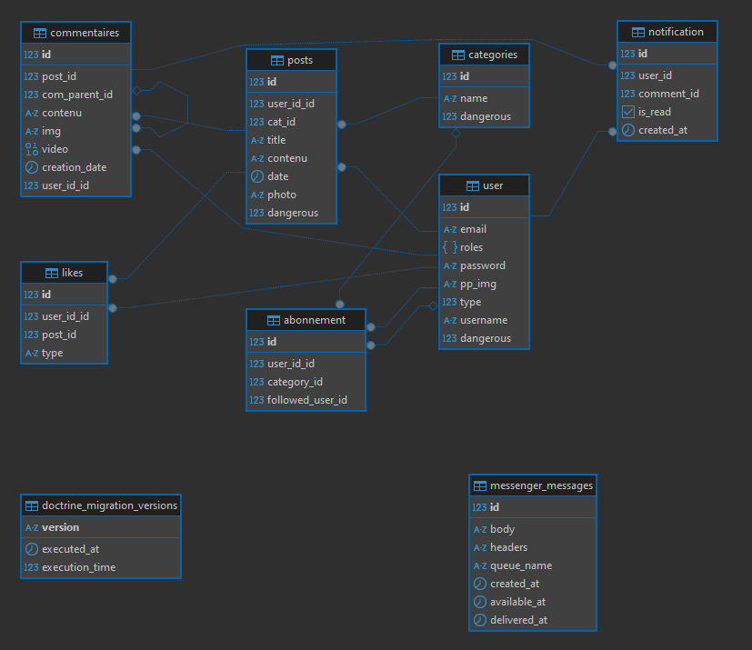
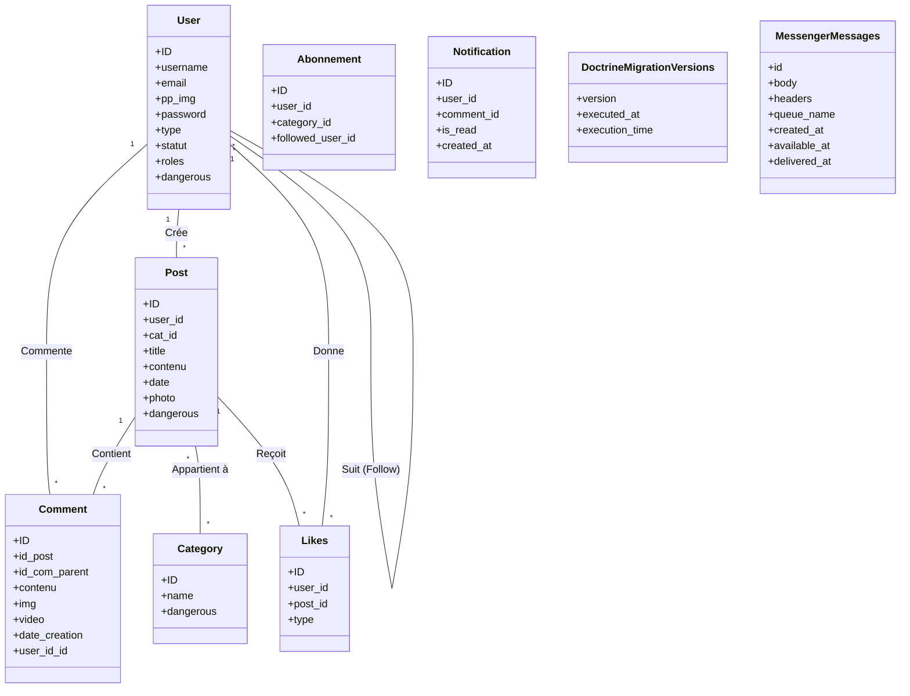
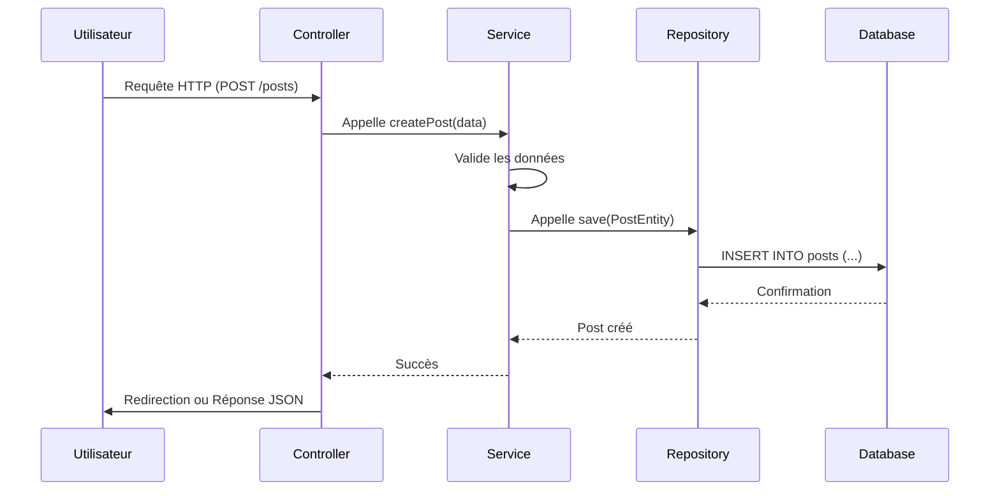
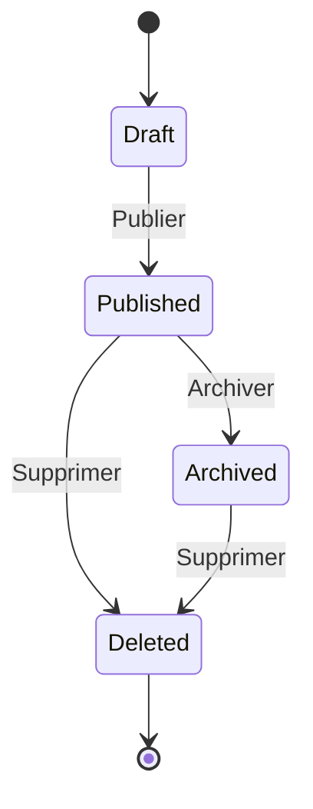

# UTSU – Forum bienveillant

## Auteurs  
- **Hamdaoui Mayssa**  
- **Merlo Meyffren Antonin**

---

## 📌 Description

**UTSU** est un forum communautaire qui met l'accent sur la **bienveillance**, le **respect** et les **échanges intelligents**.  
Inspiré de Reddit, il propose diverses catégories et sous-forums où les utilisateurs peuvent :  
- publier du contenu (texte, images),
- commenter et répondre,
- liker ou disliker,
- suivre d'autres membres.

Le système de réputation valorise les comportements positifs :
- ✅ Les utilisateurs bienveillants obtiennent des **grades élevés** et sont **mis en avant** publiquement.
- ❌ Les comportements toxiques ou un mauvais usage du français peuvent mener à une **dégradation du statut**, voire un **bannissement**.

---

## 🏗️ Architecture du Projet

### Structure Technique
```
utsu-site/
├── assets/              # Assets frontend (SCSS, JS, images)
├── bin/                 # Scripts exécutables
├── config/             # Configuration Symfony
├── migrations/         # Migrations de base de données
├── public/             # Point d'entrée public
├── src/                # Code source PHP
│   ├── Controller/     # Contrôleurs
│   ├── Entity/         # Entités Doctrine
│   ├── Repository/     # Repositories
│   └── Service/        # Services métier
├── templates/          # Templates Twig
├── tests/              # Tests unitaires et fonctionnels
└── translations/       # Fichiers de traduction
```

### Stack Technologique
- **Backend**: PHP 8.2, Symfony 7.2
- **Frontend**: Twig, JavaScript, Stimulus.js
- **Base de données**: PostgreSQL 16
- **Cache**: Redis
- **Serveur Web**: Nginx
- **CI/CD**: GitLab CI
- **Authentification**: JWT

### Architecture Logicielle
1. **Couche Présentation**
   - Contrôleurs Symfony
   - Templates Twig
   - Assets frontend

2. **Couche Métier**
   - Services Symfony
   - Logique métier
   - Validation des données

3. **Couche Données**
   - Entités Doctrine
   - Repositories
   - Migrations

4. **Sécurité**
   - Authentification JWT
   - Gestion des rôles
   - Protection CSRF
   - Validation des entrées

---

## 🚀 Installation et Configuration

### Prérequis
- PHP 8.2 ou supérieur
- Composer
- PostgreSQL 16
- Node.js et npm
- Docker et Docker Compose

### Installation

1. Cloner le repository
```bash
git clone [URL_DU_REPO]
cd utsu-site
```

2. Installer les dépendances PHP
```bash
composer install
```

3. Installer les dépendances JavaScript
```bash
npm install
```

4. Configurer l'environnement
```bash
cp .env .env.local
```
Modifier les variables d'environnement dans `.env.local` selon vos besoins.

5. Démarrer les conteneurs Docker
```bash
docker compose up -d
```

6. Créer la base de données
```bash
php bin/console doctrine:database:create
php bin/console doctrine:migrations:migrate
```

7. Charger les fixtures (optionnel)
```bash
php bin/console doctrine:fixtures:load
```

8. Compiler les assets
```bash
npm run dev
```

### Structure Détaillée du Projet

#### Backend (src/)
- `Controller/` - Contrôleurs de l'application
- `Entity/` - Entités Doctrine
- `Repository/` - Repositories pour les requêtes personnalisées
- `Form/` - Formulaires Symfony
- `Security/` - Configuration de sécurité
- `EventListener/` - Écouteurs d'événements
- `DataFixtures/` - Données de test

#### Frontend (templates/)
- `base.html.twig` - Template de base
- `account/` - Pages de gestion de compte
- `posts/` - Gestion des publications
- `categories/` - Gestion des catégories
- `commentaires/` - Système de commentaires
- `notification/` - Système de notifications
- `search/` - Fonctionnalités de recherche
- `security/` - Pages d'authentification
- `share/` - Fonctionnalités de partage

#### Assets (assets/)
- `styles/` - Fichiers CSS
- `controllers/` - Contrôleurs Stimulus
- `icon/` - Icônes et images

### Fonctionnalités Principales

#### Authentification et Sécurité
- **Système d'authentification JWT**
  - Authentification sécurisée avec JSON Web Tokens
  - Gestion des sessions utilisateur
  - Protection contre les attaques CSRF
  - Validation des tokens et gestion des expirations

- **Gestion des rôles utilisateurs**
  - Hiérarchie de rôles (Admin, Modérateur, Utilisateur)
  - Permissions granulaires par fonctionnalité
  - Système de promotion/dégradation automatique basé sur le comportement

#### Gestion de Contenu
- **Système de Posts**
  - Création de posts avec support multimédia
  - Édition et suppression de posts
  - Système de brouillon
  - Historique des modifications
  - Support du markdown
  - Système de tags et catégories

- **Système de Commentaires**
  - Commentaires imbriqués (réponses aux commentaires)
  - Édition et suppression de commentaires
  - Système de modération des commentaires
  - Notifications pour les réponses
  - Support du markdown dans les commentaires

#### Interface Utilisateur
- **Design Responsive**
  - Interface adaptative pour tous les appareils
  - Thème clair/sombre
  - Personnalisation de l'interface utilisateur
  - Animations fluides et transitions

- **Système de Notifications**
  - Notifications en temps réel
  - Notifications par email
  - Centre de notifications
  - Préférences de notification personnalisables

#### Modération et Administration
- **Panneau de Modération**
  - Interface de modération intuitive
  - File d'attente de modération
  - Historique des actions de modération
  - Système de rapports
  - Actions en masse

### CI/CD avec GitLab

#### Pipeline d'Intégration Continue
Le projet utilise GitLab CI/CD pour l'automatisation des tests et la vérification de la qualité du code.

#### Étapes de la Pipeline
1. **SecurityChecker**
   - Vérification des vulnérabilités de sécurité
   - Analyse du code avec phpcs pour la sécurité

2. **CodingStandards**
   - Vérification des standards de code avec phpcs
   - Analyse statique avec phpstan

3. **UnitTests**
   - Exécution des tests unitaires avec PHPUnit

### Commandes Utiles
```bash
# Démarrer le serveur de développement
symfony server:start

# Vérifier les routes
php bin/console debug:router

# Créer une migration
php bin/console make:migration

# Vider le cache
php bin/console cache:clear
```

---

## 🧪 Tests

### Types de Tests
1. **Tests Unitaires**
   - Tests des services et composants individuels
   - Utilisation de PHPUnit
   - Couverture de code avec PHPUnit Coverage

2. **Tests Fonctionnels**
   - Tests des fonctionnalités complètes
   - Tests des contrôleurs
   - Tests des formulaires

3. **Tests d'Intégration**
   - Tests des interactions entre composants
   - Tests de la base de données
   - Tests des API

### Exécution des Tests
```bash
# Exécuter tous les tests
php bin/phpunit

# Exécuter les tests avec couverture
php bin/phpunit --coverage-html coverage/

# Exécuter un groupe de tests spécifique
php bin/phpunit --group=unit
```

---

## 🤝 Contribution

### Processus de Contribution
1. **Fork du Projet**
   - Créer un fork du projet
   - Cloner votre fork localement

2. **Branches**
   - Créer une branche pour votre fonctionnalité
   - Nommer la branche selon le format : `feature/nom-fonctionnalite`

3. **Développement**
   - Suivre les standards de code
   - Écrire des tests pour les nouvelles fonctionnalités
   - Documenter les changements

4. **Pull Request**
   - Mettre à jour votre fork
   - Créer une Pull Request
   - Décrire les changements en détail

### Standards de Code
- PSR-12 pour le PHP
- ESLint pour le JavaScript
- Stylelint pour le CSS/SCSS
- Documentation PHPDoc

---

## 🚀 Déploiement

### Environnements
1. **Développement**
   - Serveur local avec Docker
   - Base de données PostgreSQL locale
   - Assets en mode développement

2. **Staging**
   - Serveur de pré-production
   - Base de données de test
   - Configuration similaire à la production

3. **Production**
   - Serveur de production
   - Base de données de production
   - Optimisations activées

### Processus de Déploiement
1. **Préparation**
   ```bash
   # Compiler les assets pour la production
   npm run build
   
   # Vider le cache
   php bin/console cache:clear --env=prod
   ```

2. **Déploiement**
   ```bash
   # Mettre à jour le code
   git pull origin main
   
   # Mettre à jour les dépendances
   composer install --no-dev --optimize-autoloader
   
   # Appliquer les migrations
   php bin/console doctrine:migrations:migrate --env=prod
   ```

3. **Vérification**
   - Tests de smoke
   - Vérification des logs
   - Monitoring des performances

---

## 🗄️ Schéma et Description de la Base de Données



La base de données du projet Utsu Site est conçue pour gérer efficacement les interactions sociales, la modération et la gestion de contenu. Voici une description des principales tables :

- **user** :
  - Gère les comptes utilisateurs (email, rôles, mot de passe, image de profil, type, nom d'utilisateur, statut de dangerosité).

- **posts** :
  - Contient les publications des utilisateurs, associées à une catégorie et à un utilisateur. Supporte le contenu texte, les images, la date de publication et un indicateur de contenu dangereux.

- **commentaires** :
  - Gère les commentaires sur les posts, avec support des réponses imbriquées (com_parent_id), images, vidéos, date de création et auteur.

- **categories** :
  - Liste les différentes catégories de posts, avec un indicateur de dangerosité.

- **likes** :
  - Permet aux utilisateurs d'aimer ou de disliker des posts. Stocke l'utilisateur, le post et le type d'interaction.

- **abonnement** :
  - Gère les abonnements entre utilisateurs et/ou catégories (suivi d'utilisateurs ou de catégories).

- **notification** :
  - Stocke les notifications envoyées aux utilisateurs (liées à un commentaire, état de lecture, date de création).

- **doctrine_migration_versions** :
  - Historique des migrations Doctrine (version, date d'exécution, temps d'exécution).

- **messenger_messages** :
  - Messages utilisés par le composant Messenger de Symfony (file d'attente, corps, en-têtes, dates).

Ce schéma relationnel permet de garantir l'intégrité des données, la performance des requêtes et la flexibilité pour l'évolution future de la plateforme.

---

## 📊 Diagrammes UML

### Diagramme de Classes


### Diagramme de Séquence (Création de Post)


### Diagramme d'État (Post)


---

## 🔒 Sécurité

### Authentification
- JWT pour l'authentification API
- Sessions sécurisées pour le web
- Protection contre les attaques par force brute
- Gestion des tokens de réinitialisation

### Autorisation
- RBAC (Role-Based Access Control)
- Vérification des permissions
- Validation des entrées utilisateur
- Protection CSRF sur tous les formulaires

### Protection des Données
- Chiffrement des données sensibles
- Hachage des mots de passe (Argon2id)
- Validation des fichiers uploadés
- Protection contre les injections SQL

### Sécurité de l'Application
- Headers de sécurité (CSP, HSTS, etc.)
- Rate limiting
- Validation des entrées
- Protection XSS
- Logging des actions sensibles

### Bonnes Pratiques
- Mise à jour régulière des dépendances
- Scan de vulnérabilités
- Audit de sécurité
- Documentation des procédures de sécurité

---

## 🧩 Modèle de base de données (UML simplifié)

### `Users`
- `ID` (BIGINT, PK)  
- `username` (TEXT, NOT NULL)  
- `email` (TEXT, NOT NULL, UNIQUE)  
- `pp_img` (BLOB)  
- `password` (TEXT, NOT NULL)  
- `type` (INT, NOT NULL)  
- `statut` (INT, NOT NULL)

### `Categories`
- `ID` (BIGINT, PK)  
- `name` (TEXT, NOT NULL)

### `Posts`
- `ID` (BIGINT, PK)  
- `user_id` (BIGINT, FK → Users.ID, ON DELETE CASCADE)  
- `cat_id` (BIGINT, FK → Categories.ID, ON DELETE CASCADE)  
- `title` (TEXT, NOT NULL)  
- `contenu` (TEXT, NOT NULL)  
- `date` (DATETIME, NOT NULL, DEFAULT CURRENT_TIMESTAMP)  
- `photo` (BLOB)

### `Commentaires`
- `ID` (BIGINT, PK)  
- `id_post` (BIGINT, FK → Posts.ID, ON DELETE CASCADE)  
- `id_com_parent` (BIGINT, FK → Commentaires.ID, NULL)  
- `contenu` (TEXT, NOT NULL)  
- `img` (BLOB)  
- `video` (BLOB)  
- `date_creation` (DATETIME, NOT NULL, DEFAULT CURRENT_TIMESTAMP)

### `Likes`
- `ID` (BIGINT, PK)  
- `user_id`

## 📋 Spécifications Fonctionnelles

### Rôles Utilisateurs

1. **Visiteur (Non authentifié)**
   - Consultation des posts publics
   - Inscription/Connexion
   - Recherche de contenu

2. **Utilisateur Authentifié**
   - Création et modification de posts
   - Commentaires et réponses
   - Like/Dislike
   - Suivi d'autres utilisateurs
   - Gestion du profil
   - Notifications

3. **Modérateur**
   - Gestion des contenus inappropriés
   - Attribution des grades
   - Gestion des utilisateurs
   - Accès aux statistiques

### Cas d'Utilisation Principaux

1. **Publication de Contenu**
   ```
   Utilisateur -> Connexion -> Sélection Catégorie -> Création Post -> Upload Media -> Publication
   ```

2. **Interaction Communautaire**
   ```
   Utilisateur -> Consultation Post -> Commentaire/Like -> Notification -> Réponse
   ```

3. **Gestion de la Réputation**
   ```
   Système -> Analyse Comportement -> Attribution Grade -> Mise à jour Statut
   ```

### Contraintes Non Fonctionnelles

1. **Performance**
   - Temps de chargement < 2 secondes
   - Optimisation des images
   - Mise en cache Redis
   - Pagination des résultats

2. **Sécurité**
   - Authentification sécurisée
   - Protection XSS/CSRF
   - Validation des entrées
   - Gestion sécurisée des fichiers

3. **Accessibilité**
   - Conformité WCAG 2.1
   - Support lecteurs d'écran
   - Navigation clavier
   - Contraste suffisant

4. **Maintenabilité**
   - Tests unitaires
   - Documentation du code
   - Standards de codage
   - CI/CD automatisé